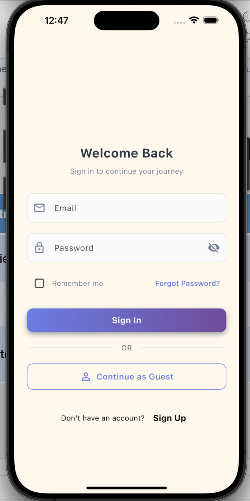
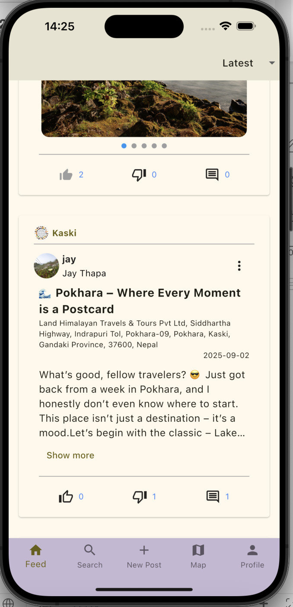
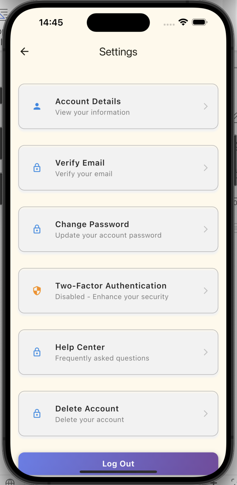

# Tourism-Centric Social Networking App

A full-stack mobile application that connects **tourists and locals** through interactive, location-based communities.  
Built using **Flutter**, **ASP.NET Core**, and **MongoDB**, this app enables travelers to share experiences, ask location-specific questions, and discover hidden destinations in Nepal.

---

## 🌟 Features
- **Location-Based Communities** – Create and explore posts tied to districts, landmarks, or custom map pins.
- **Secure Authentication** – JWT authentication, email verification, and Two-Factor Authentication (2FA).
- **Role-Based Access** – Guest, Registered User, and Moderator roles with tailored permissions.
- **Interactive Map** – Integrated **OpenStreetMap** for navigation, path recording, and real-time community banners.
- **Community Engagement** – Upvote/downvote system, comments, and content moderation.
- **Search & Discovery** – Filter posts, users, and locations; explore trending or shuffled content.
- **Offline Ready** – Pagination and caching for smoother browsing in low-connectivity areas.

---

## 🛠️ Tech Stack

| Layer        | Technology / Libraries | Purpose |
|--------------|-------------------------|--------|
| **Frontend** | Flutter, GetWidget, Dio/http, SharedPreferences, intl, latlong2, geolocator, Image Picker, TypeAhead | Cross-platform UI, API calls, state management, location services |
| **Backend**  | ASP.NET Core, JWT Bearer Authentication, ASP.NET Identity, LINQ, PBKDF2 (built-in) | RESTful APIs, secure authentication, role management |
| **Database** | MongoDB, MongoDB.Driver, MongoDB.Bson, MongoDB.Identity | NoSQL storage for users, posts, and communities |
| **Maps / APIs** | OpenStreetMap, MapTiler, LocationIQ | Interactive mapping, geocoding, routing |
| **Tools**    | GitHub, Swagger (Swashbuckle.AspNetCore) | Version control, API documentation |

---

## 📱 App Flow
1. **Login / Sign Up** – Users can register, log in, reset password, or continue as a guest.
2. **Feed Page** – View paginated posts sorted by *Latest* or *Explore*.
3. **Community Page** – Browse posts filtered by location.
4. **Map Page** – View communities on an interactive map, search locations, record travel paths.
5. **Create Post** – Share text, images, and questions; tag exact locations.
6. **Profile & Settings** – Manage account, enable 2FA, verify email, or moderate content.

## 📸 Screenshots
<p align="center">
  
  
  
  
</p>


---

## 🚀 Getting Started

### Installation
1. **Clone the Repository**
   ```bash
   git clone https://github.com/shr-gitt/Tourism-Centric-Social-Networking-App.git   
